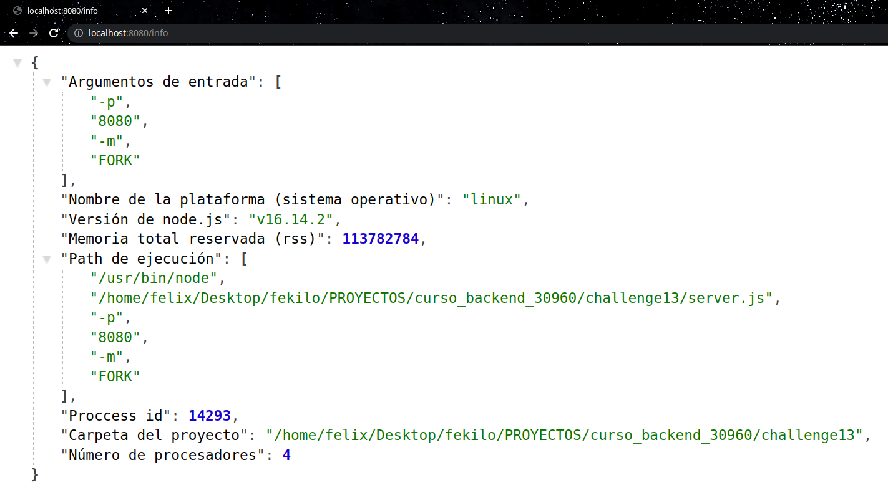
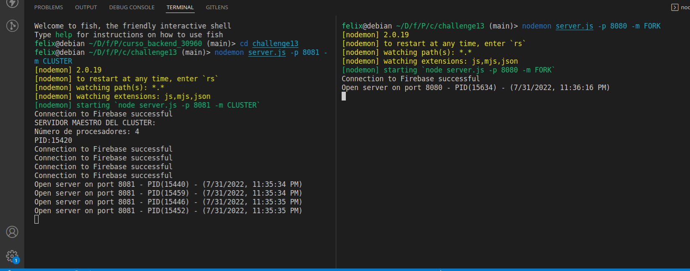
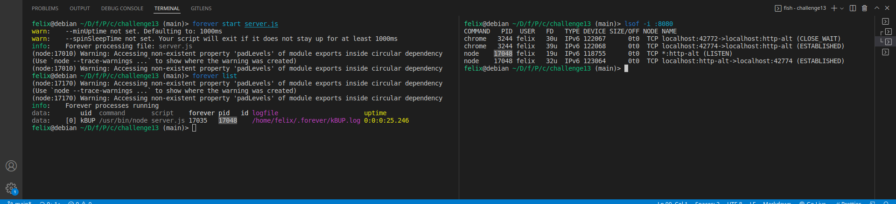
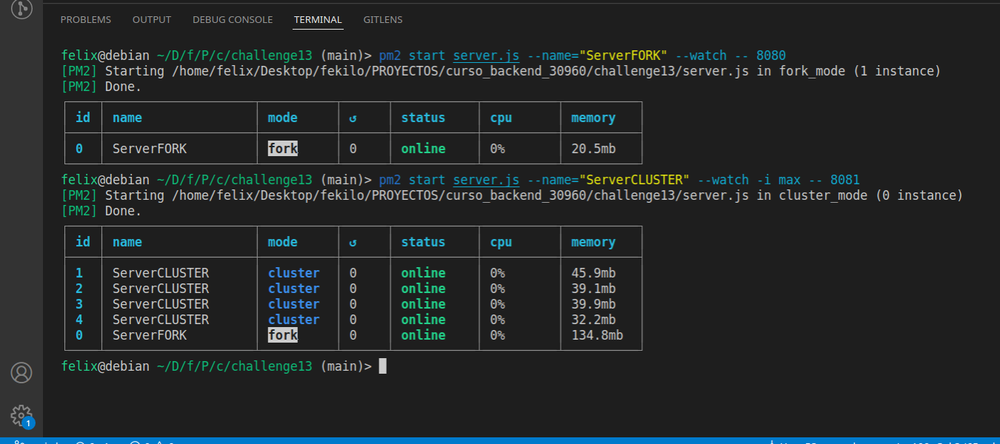

# Desafío 13: Servidor con balance de carga

1. Ejecute el script **DBscript** para crear o resetear:

   - La tabla products y users en SQLite3.

   ```
     npm run DBscript
   ```

2. Defina las configuraciones en el archivo .env acorde al archivo .env.example

- Firebase se usa para los mensajes del chat.
- SQLite para productos y manejo de usuarios.
- MongoDB para manejar las sesiones del usuario.

3. Ejecute el siguiente script para iniciar el proyecto

   ```
     npm run dev
   ```

## Puntos del desafío

Para el presente desafío se considera varios puntos. Por ende se considera la resolución paso a paso para facilitar la revisión. (SO Debian GNU/Linux 11)

**Consigna 1:**

Tomando con base el proyecto que vamos realizando, agregar un parámetro más en la ruta de comando que permita ejecutar al servidor en modo fork o cluster. Dicho parámetro será 'FORK' en el primer caso y 'CLUSTER' en el segundo, y de no pasarlo, el servidor iniciará en modo fork.


```
// ...
const cluster = require('cluster')
const os = require('os')

const { PORT, MODE } = parseArgs(process.argv.slice(2), { 
  alias: { 
    p: "PORT",
    m: "MODE",
  },
  default: { 
    PORT: 8080,
    MODE: "FORK",
  }
})

if (MODE === 'CLUSTER' && cluster.isPrimary) {
  const numCpus = os.cpus().length

  console.log('SERVIDOR MAESTRO DEL CLUSTER: ')
  console.log('Número de procesadores: ' + numCpus)
  console.log('PID:' + process.pid)

  for (let i = 0; i < numCpus; i++) {
    cluster.fork()
  }

  cluster.on('exit', worker => {
    console.log('Worker ' + process.pid + ' exit')
    cluster.fork()
  })
} else {
  const app = express()
  const httpServer = new HttpServer(app)
  const io = new IOServer(httpServer)
  // ...
}
```

- Agregar en la vista info, el número de procesadores presentes en el servidor.

  Revisar en el endpoint: http://localhost:8080/info

  

- Ejecutar el servidor (modos FORK y CLUSTER) con nodemon verificando el número de procesos tomados por node.

  Comandos a ejecutar: 
  ```
    nodemon server.js -p 8080 -m FORK
    nodemon server.js -p 8081 -m CLUSTER
  ```
  Nota: Considerar que las peticiones en el Frontend solo funcionan el puerto 8080 ya que no se ha configurado dominio.
  

- Ejecutar el servidor (con los parámetros adecuados) utilizando Forever, verificando su
correcta operación. Listar los procesos por Forever y por sistema operativo.

  Comandos a ejecutar: 
  ```
    forever start server.js
    forever list
    lsof -i :8080
  ```
  Nota: No olvidar cerrar el proceso luego de la prueba, puede usar: forever stopall
  

- Ejecutar el servidor (con los parámetros adecuados: modo FORK) utilizando PM2 en sus
modos modo fork y cluster. Listar los procesos por PM2 y por sistema operativo.

  Modo FORK:
  ```
  pm2 start server.js --name="ServerFORK" --watch -- 8080

  ```
  Modo CLUSTER:
  ```
  pm2 start server.js --name="ServerCLUSTER" --watch -i max -- 8081
  ```
  

**Consigna 2:**

Configurar Nginx para balancear cargas de nuestro servidor de la siguiente manera:

Redirigir todas las consultas a /api/randoms a un cluster de servidores escuchando en el puerto
8081. El cluster será creado desde node utilizando el módulo nativo cluster.

El resto de las consultas, redirigirlas a un servidor individual escuchando en el puerto 8080.

Verificar que todo funcione correctamente.

**Solución:**

Nota: Ejecutar el server en los puertos 8080 y 8081 de la forma que considere mejor (cluster, forever o pm2)

/etc/nginx/ngnix.conf modificado 1: 
```
events {
}

http {
    include       mime.types;
    default_type  application/octet-stream;

    upstream node_app {
        server 127.0.0.1:8080;
    }

    upstream node_app2 {
        server 127.0.0.1:8081;
    }

    server {
        listen       80;
        server_name  nginx_node;

        location /datos/ {
            proxy_pass http://node_app;
        }
        
        location /api/randoms {
            proxy_pass http://node_app2;
        }
    }
}
```

Luego, modificar la configuración para que todas las consultas a /api/randoms sean redirigidas a un cluster de servidores gestionado desde nginx, repartiéndolas equitativamente entre 4 instancias escuchando en los puertos 8082, 8083, 8084 y 8085 respectivamente.

**Solución:**

Nota: Ejecutar el server en los puertos 8080, 8082, 8083, 8084 y 8085 de la forma que considere mejor (cluster, forever o pm2)

/etc/nginx/ngnix.conf modificado 2:
```
events {
}

http {
    include       mime.types;
    default_type  application/octet-stream;

    upstream node_app {
        server 127.0.0.1:8080;
    }

    upstream node_app2 {
        server 127.0.0.1:8082;
        server 127.0.0.1:8083;
        server 127.0.0.1:8084;
        server 127.0.0.1:8085;
    }

    server {
        listen       80;
        server_name  nginx_node;

        location /datos/ {
            proxy_pass http://node_app;
        }
        
        location /api/randoms {
            proxy_pass http://node_app2;
        }
    }
}
```