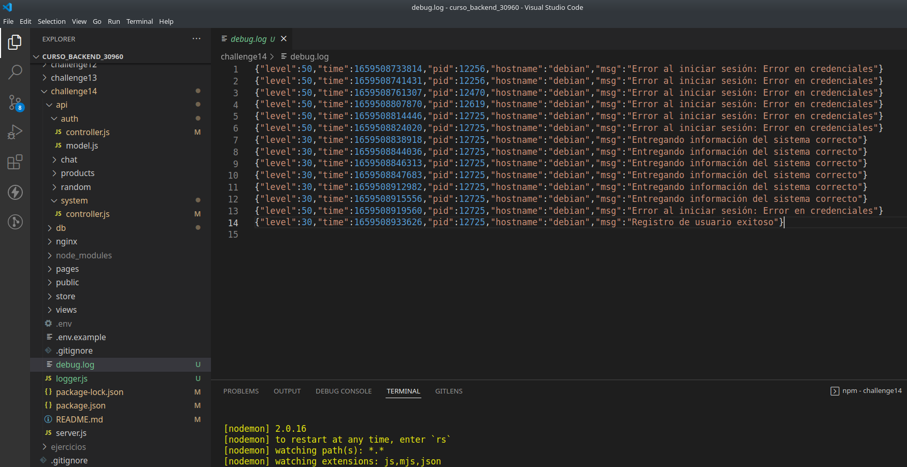
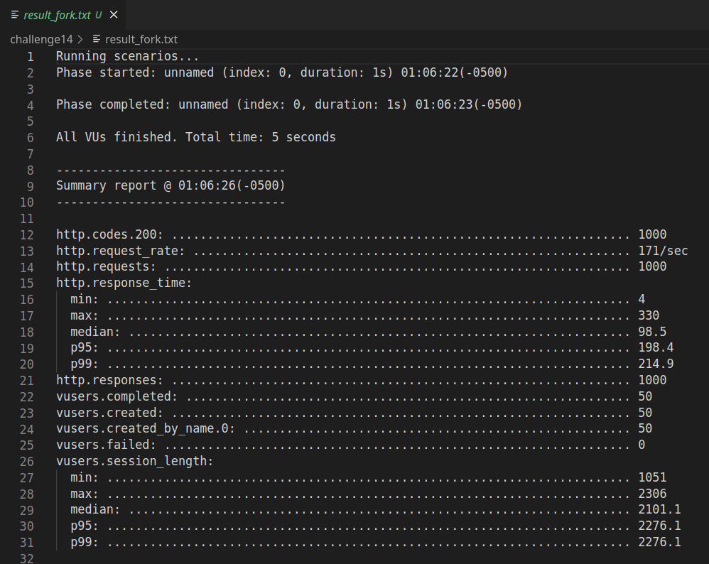
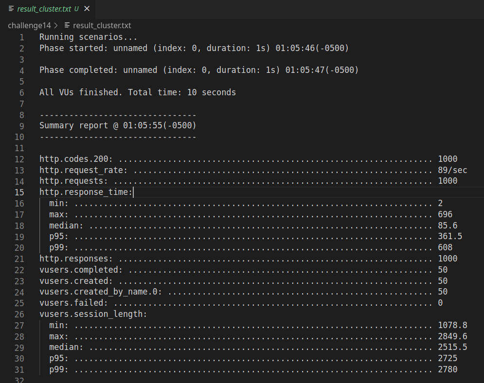
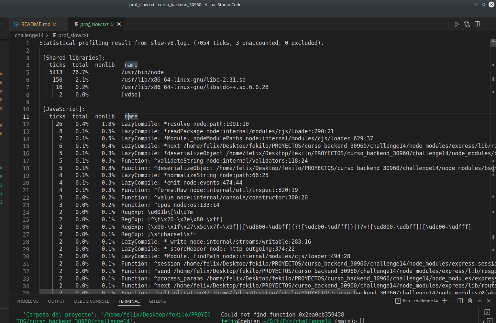
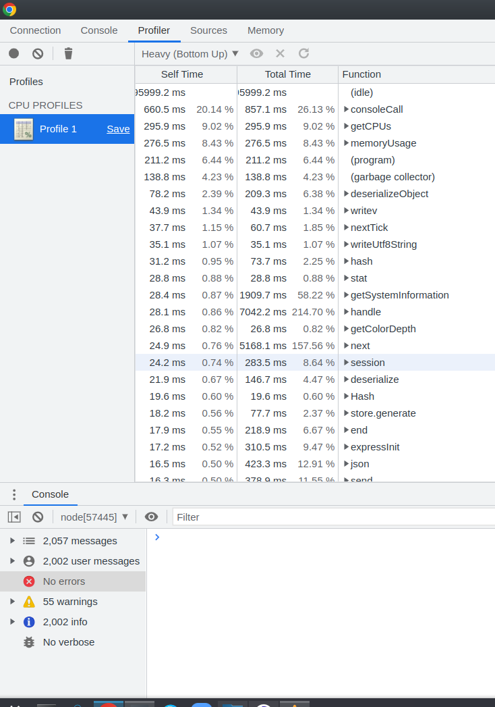
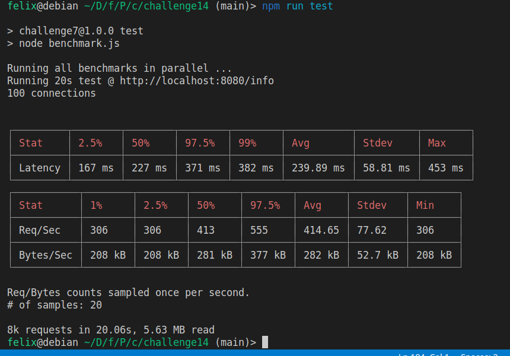
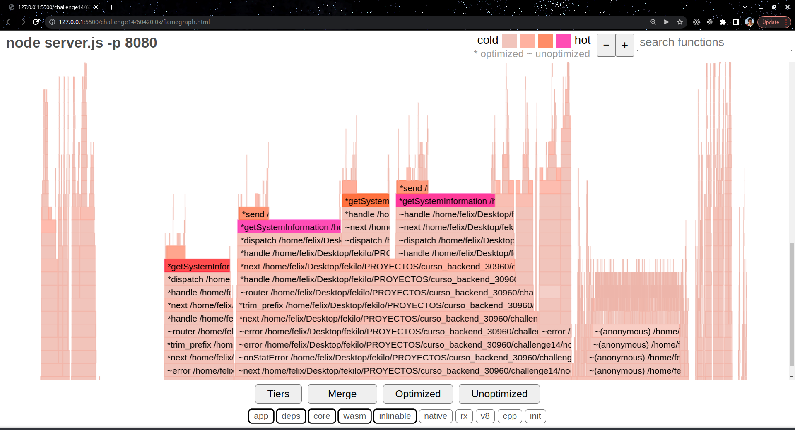

# Desafío 14: Loggers, gzip y análisis de performance

1. Ejecute el script **DBscript** para crear o resetear:

   - La tabla products y users en SQLite3.

   ```
     npm run DBscript
   ```

2. Defina las configuraciones en el archivo .env acorde al archivo .env.example

- Firebase se usa para los mensajes del chat.
- SQLite para productos y manejo de usuarios.
- MongoDB para manejar las sesiones del usuario.

3. Ejecute el siguiente script para iniciar el proyecto

   ```
     npm run dev
   ```
## Puntos del desafío

### **Consigna parte 1:**
---
Incorporar al proyecto de servidor de trabajo la compresión gzip.

Verificar sobre la ruta /info con y sin compresión, la diferencia de cantidad de bytes devueltos en un
caso y otro.


- Prueba del endpoint sin compresión: http://localhost:8080/info
- Prueba del endpoint con gzip: http://localhost:8080/info/gzip

```
const systemRouter = require('express').Router()
const os = require('os')
const compression = require('compression')

systemRouter.get('/', getSystemInformation)
systemRouter.get('/gzip', compression(), getSystemInformation)

function getSystemInformation(req, res){
  res.json({
    'Argumentos de entrada': process.argv.slice(2),
    'Nombre de la plataforma (sistema operativo)': process.platform,
    'Versión de node.js': process.version,
    'Memoria total reservada (rss)': process.memoryUsage().rss,
    'Path de ejecución':  process.argv.slice(0),
    'Proccess id': process.pid,
    'Carpeta del proyecto': process.cwd(),
    'Número de procesadores': os.cpus().length,
  })
}

module.exports = systemRouter
```

- Luego implementar loggueo (con alguna librería vista en clase) que registre lo siguiente:
  - Ruta y método de todas las peticiones recibidas por el servidor (info)
  - Ruta y método de las peticiones a rutas inexistentes en el servidor (warning)
  - Errores lanzados por las apis de mensajes y productos, únicamente (error)

  ```
  const pino = require('pino')

  function buildDevLogger() {
    const devLogger = pino('debug.log')
    devLogger.level = 'info'
    return devLogger
  }

  let logger = buildDevLogger()

  module.exports = logger
  ```
  


### **Consigna parte 2:**
---
1) El perfilamiento del servidor, realizando el test con --prof de node.js. Analizar los resultados obtenidos
luego de procesarlos con --prof-process.

Utilizaremos como test de carga Artillery en línea de comandos, emulando 50 conexiones concurrentes con
20 request por cada una. Extraer un reporte con los resultados en archivo de texto.


**PRUEBAS CON ARTILLERY EN MODO FORK Y CLUSTER:**
- Al endpoint info: localhost:8080/info
- 50 conexiones concurrentes con 20 peticiones cada una.
- Reportes en los archivos: result_fork.txt y result_cluster.txt

```
node server.js -p 8080 -m FORK
artillery quick -c 50 -n 20 "http://localhost:8080/info" > result_fork.txt
```



```
node server.js -p 8080 -m CLUSTER
artillery quick -c 50 -n 20 "http://localhost:8080/info" > result_cluster.txt
```



**PRUEBAS SOBRE PROFILING:**

- Manejado en consola.
1. Ejecutamos el server y realizamos test con artillery

```
node --prof server.js
artillery quick -c 50 -n 20 "http://localhost:8080/info" > artillery_slow.txt
```
2. Luego renombramos el archivo generado a slow-v8.log

```
node --prof-process slow-v8.log > prof_slow.txt
```



- Usando la devtools de node

1. Ejecutamos el server en modo inspect

```
node --inspect server.js
```
2. En el navegador abrimos las devtool de node con: chrome://inspect

3. Realizamos test con artillery

```
artillery quick -c 50 -n 20 "http://localhost:8080/info" > artillery_slow.txt
```



**Consigna parte 3:**

Luego utilizaremos Autocannon en línea de comandos, emulando 100 conexiones concurrentes realizadas
en un tiempo de 20 segundos. Extraer un reporte con los resultados

**PRUEBAS CON AUTOCANNON**
- Al endpoint http://localhost:8080/info

1. Código de test

```
const autocannon = require('autocannon')
const { PassThrough } = require('stream')

function run(url) {
  const buf = []
  const outputStream = new PassThrough()

  const inst = autocannon({
    url,
    connections: 100,
    duration: 20
  })

  autocannon.track(inst, { outputStream })

  outputStream.on('data', data => buf.push(data))
  inst.on('done', () => {
    process.stdout.write(Buffer.concat(buf))
  })
}

console.log('Running all benchmarks in parallel ...')

run('http://localhost:8080/info')
```

2. Se agregá dos scripts en package.json:

```
"start": "0x server.js -p 8080",
"test": "node benchmark.js"
```

3. Ejecutar npm run start.
4. ejecutar el npm run test.



5. Detener la ejecución del server y revisar el flamegraph generado.

