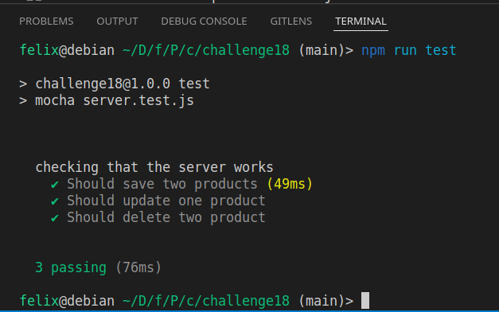

# Desafío 18: Testeamos nuestra API REST

- Se implementa test con mocha para api de productos.
- Refactor:
  - Uso de ECMAScript modules.
  - Solución de bugs gracias a los tests.

---


---

**Este desafío es la mejora del Desafío 17.**

1. Ejecute el script **DBscript** para crear o resetear:

   - La tabla products y users en SQLite3.

   ```
     npm run DBscript
   ```

2. Defina las configuraciones en el archivo .env acorde al archivo .env.example

- Firebase se usa para los mensajes del chat.
- SQLite para productos y manejo de usuarios.
- MongoDB para manejar las sesiones del usuario.

3. Ejecute el siguiente script para iniciar el proyecto

   ```
     npm run dev
   ```