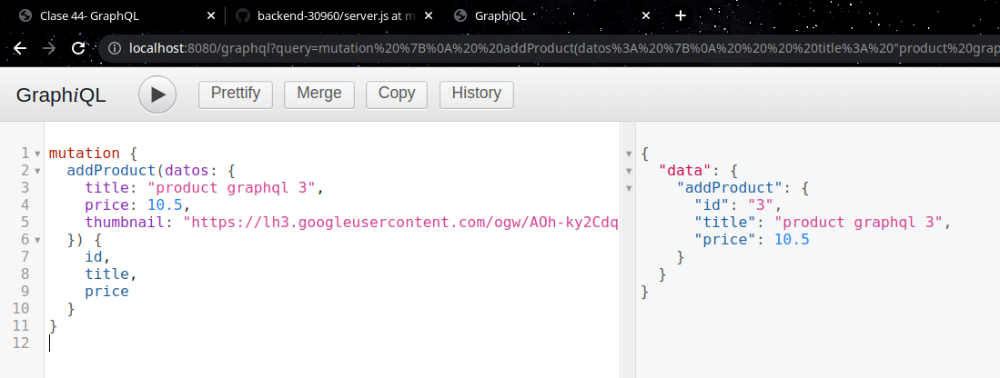

# Desafío 19: Reformar para usar GraphQL

- Se implementa GraphQL para manejar el CRUD de producto. Revisar toda la lógica en el controlador productGraphqlController.js

---


---

Queries:

- Get products
```
{
	getProducts {
		id,
		title,
		price,
	}
}
```

- Add product
```
mutation {
  addProduct(datos: {
    title: "product graphql 3",
    price: 10.5,
    thumbnail: "https://lh3.googleusercontent.com/ogw/AOh-ky2CdqY2t24jIxDIHAt3WcEMB0UbaodZsnyL8Ip1fA=s64-c-mo"
  }) {
    id,
		title
  }
}
```

- Delete product
```
mutation {
  deleteProduct(id: 2) {
    id
		title
  }
}
```

- Update product
```
mutation {
  updateProduct(datos: {
		id: 3,
    title: "product graphql 3 actualizado",
    price: 10.5,
    thumbnail: "https://lh3.googleusercontent.com/ogw/AOh-ky2CdqY2t24jIxDIHAt3WcEMB0UbaodZsnyL8Ip1fA=s64-c-mo"
  }) {
    id,
		title
  }
}
```


**Este desafío tiene como base el Desafío 18.**

1. Ejecute el script **DBscript** para crear o resetear:

   - La tabla products y users en SQLite3.

   ```
     npm run DBscript
   ```

2. Defina las configuraciones en el archivo .env acorde al archivo .env.example

- Firebase se usa para los mensajes del chat.
- SQLite para productos y manejo de usuarios.
- MongoDB para manejar las sesiones del usuario.

3. Ejecute el siguiente script para iniciar el proyecto

   ```
     npm run dev
   ```